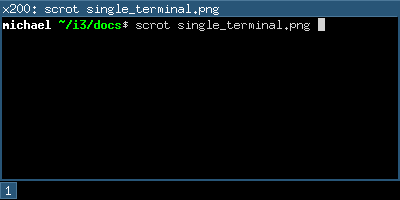
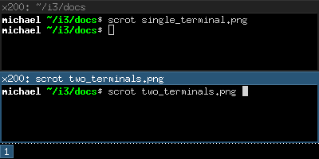

# 打开终端和移动焦点

打开新终端是一个非常基本的操作。默认情况下，这个操作的按键绑定是 `$mod + Enter`，即默认配置中的 Alt + Enter（`Mod1 + Enter`）。按下 `$mod + Enter` 打开一个新终端，它将填满屏幕上的整个可用空间。

如果此时打开另一个终端，i3 会将其放置在当前终端的旁边，并将屏幕大小分成两半。i3 会取决显示器的设置，将创建的窗口放在现有窗口的旁边（宽屏显示器）或其下方（旋转显示器）。

要在两个终端之间移动焦点，可以使用你可能从 `vi` 编辑器那儿知道的方向快捷键。然而，在 i3 中，这类快捷键将使用八基本键（也称导位键，即 `A`、`S`、`D`、`F` 和 `J`、`K`、`L`、`;` 这一排八个按键 —— 译者注；在 `vi` 中，为了和大多数键盘布局兼容，这些快捷键向左移了一位）。因此，`$mod + j` 是往左，`$mod + k` 是往下，`$mod + l` 是往上而 `$mod + ;` 是往右。所以，要在终端间切换，请使用 `$mod + k` 或 `$mod + l`。当然，箭头方向键也是可以使用的。

现在，工作区（它包含两个终端）已经在特定方向上被拆分了（默认为水平）。就像工作区一样，每个窗口都可以再次被水平或垂直地拆分。“窗口”这个术语是指实际包含了 X11 窗口（如终端或浏览器）的容器，“拆分容器”则表示包含了一个或多个窗口的容器。

TODO：“树”的图片

要垂直拆分一个窗口，请在创建新窗口前按下 `$mod + v`。要水平拆分则按下 `$mod + h`。
